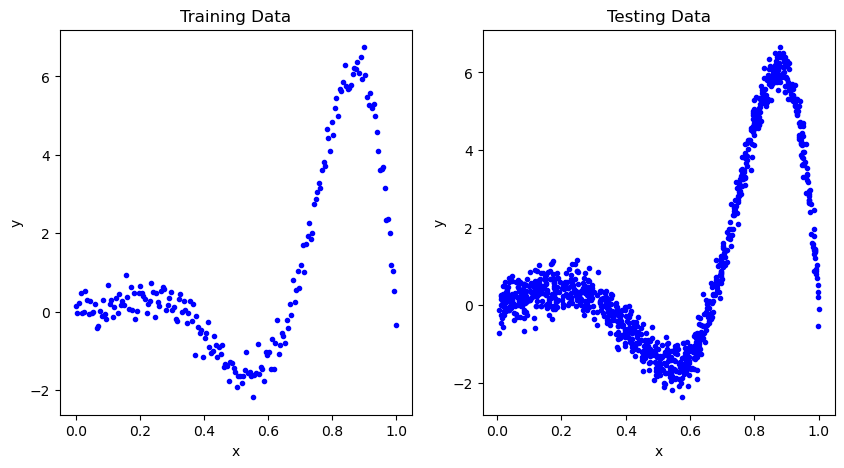
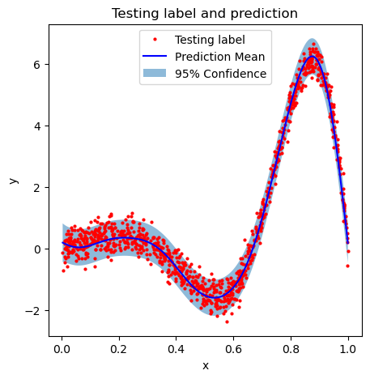

# 1. Basic usage of HiGP

## 1.1 Install HiGP

HiGP is a Python3 library that can be installed using `pip`. We strongly recommend using HiGP in a [conda](https://www.anaconda.com/blog/understanding-conda-and-pip) environment. You may follow [this page](https://conda.io/projects/conda/en/latest/user-guide/tasks/manage-environments.html) to install conda and create a conda environment. To install HiGP, make sure you have installed the following packages:

* Python 3.10 or a newer version,
* NumPy 2.2.2 or a newer version,
* SciPy 1.15 or a newer version,
* PyTorch 2.5.1 or a newer version,
* Matplotlib, if you wish to plot your results.

Then, simply run the following command in your conda environment to download and install the latest version of HiGP.

```python
pip install higp
```

## 1.2 A simple example

We use a simple example to show the basic usage of HiGP. In this example, we train a RBF (Gaussian) kernel GP for a one-dimensional function. We will be modeling the function

```math
y = 0.2 \, \sin(3 \pi x) \, \exp(4x) + \epsilon, \quad 
\epsilon \sim \! N(0, 0.09)
```

First import the libraries we need to use:

```python
import numpy as np
import matplotlib.pyplot as plt
import math
import higp
```

Now let's set up the training and testing data. For the training data, we 200 regularly spaced points on $[0, 1]$. For the testing data, we use 1000 random points selected
uniformly on $[0, 1]$.

```python
np.random.seed(42)
n_train = 200
n_test  = 1000
train_x = np.linspace(0, 1, n_train)
train_y = 0.2 * np.sin(3 * math.pi * train_x) * np.exp(4 * train_x) 
train_y += np.random.randn(train_x.size) * math.sqrt(0.09)
test_x  = np.sort(np.random.rand(n_test))
test_y  = 0.2 * np.sin(3 * math.pi * test_x) * np.exp(4 * test_x)
test_y += np.random.randn(test_x.size) * math.sqrt(0.09)
```

The following figure shows the training set and the test set:



HiGP has an "easy GP regression" (ezgpr) interface to train the model and test the trained model in one line:

```python
pred = higp.ezgpr_torch(train_x, train_y, test_x, test_y, adam_lr=0.1, adam_maxits=100)
# pred.prediction_mean is the predictive mean values
# pred.prediction_stddev is thepredictive standard deviations
```

The "ezgpr_torch" interface uses the [PyTorch Adam optimizer](https://pytorch.org/docs/stable/generated/torch.optim.Adam.html). Optional parameters specify the learning rate and the maximum number of Adam iterations. The interface uses the RBF (Gaussian) kernel function by default, and it returns two arrays of the same size as `test_x`: `pred.prediction_mean` is the predictive mean values, `pred.prediction_stddev` is the predictive standard deviations. For more details, see [Section 3.5 Method ezgpr_torch](https://github.com/huanghua1994/HiGP/blob/main/docs/3-API-reference.md#35-method-ezgpr_torch).

We can use the following code to visualize the predictions:

```python
fig = plt.figure(figsize=(5, 5))
plt.plot(test_x, test_y, 'ro', markersize=2)
plt.plot(test_x, pred.prediction_mean, 'b-')
plt.fill_between(test_x, pred.prediction_mean - 1.96 * pred.prediction_stddev, pred.prediction_mean + 1.96 * pred.prediction_stddev, alpha=0.5)
plt.title('Testing label and prediction')
plt.xlabel('x')
plt.ylabel('y')
plt.legend(['Testing label', 'Prediction Mean', '95% Confidence'], loc='upper center')
plt.show()
plt.close(fig)
```



Instead of using the "ezgpr" interface, we can manually define a model for this problem and call the optimizer directly. Before defining the model, set the data type to be used and make sure the training and testing data have the data type expected by the optimizer:

```python
import torch
np_dtype = np.float32
torch_dtype = torch.float32 if np_dtype == np.float32 else torch.float64
train_x = train_x.astype(np_dtype)
train_y = train_y.astype(np_dtype)
test_x = test_x.astype(np_dtype)
test_y = test_y.astype(np_dtype)
```

Then we can set up a GP regression model, by specifying the training data and kernel function:

```python
gpr_problem = higp.gprproblem.setup(data=train_x, label=train_y, kernel_type=higp.GaussianKernel)
model = higp.GPRModel(gpr_problem, dtype=torch_dtype)
optimizer = torch.optim.Adam(model.parameters(), lr=0.1)
```

Then we call the optimizer directly to train the model:

```python
higp.gpr_torch_minimize(model, optimizer, maxits=100, print_info=True)
```

Finally, we can ask the trained model for predictions:

```python
pred = higp.gpr_prediction(data_train=train_x,
                           label_train=train_y,
                           data_prediction=test_x,
                           kernel_type=higp.GaussianKernel,
                           gp_params=model.get_params())
```

The obtained `pred` is the same as the output of `higp.ezgpr_torch()`.
